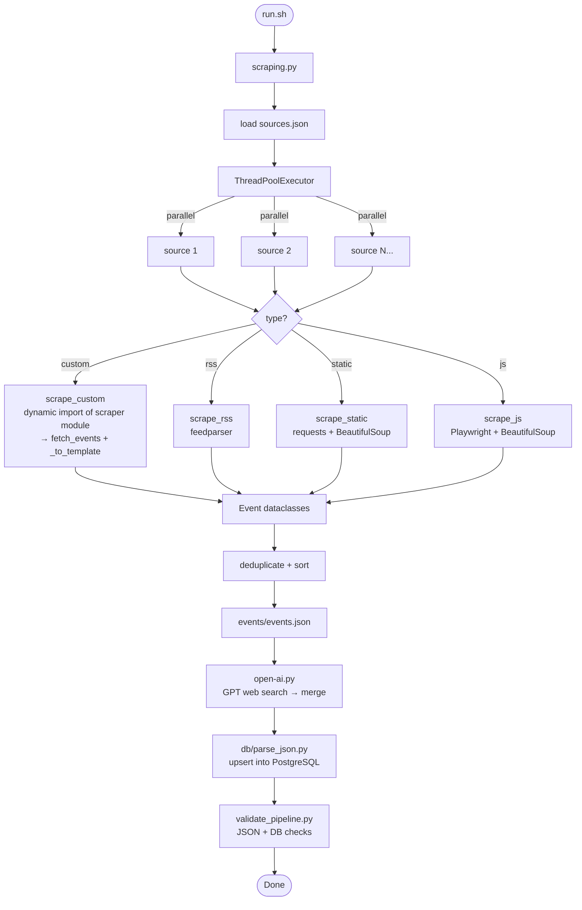

# Scraping Documentation

## How the Pipeline Works

`run.sh` runs four steps sequentially:

```
1. scraping.py      → scrape all sources in parallel → events/events.json
2. open-ai.py       → GPT web search for extra events in the next 14 days → merge into events.json
3. db/parse_json.py → ingest events.json into PostgreSQL (upserts events, auto-creates source rows)
4. validate_pipeline.py → checks JSON + DB consistency, fails the pipeline if something is wrong
```

Step 2 is non-fatal — if the OpenAI key is missing or the call fails, the pipeline continues.

### Scraping (`scraping.py`)

Loads `sources.json`, dispatches all sources in parallel via `ThreadPoolExecutor`. Each source has a `type` that determines how it's scraped:

| Type | How it works |
|---|---|
| `custom` | Loads a Python module (named in `"scraper"` field), calls `fetch_events()` + `_to_template()` |
| `rss` | Parses an RSS/Atom feed via `feedparser` |
| `static` | HTTP GET + BeautifulSoup with CSS selectors from `sources.json` |
| `js` | Playwright headless browser + BeautifulSoup (for JS-rendered pages) |

Most sources use `custom`. The `static`, `rss`, and `js` types are generic — they work purely from config in `sources.json` without a dedicated scraper file.

### AI Enrichment (`open-ai.py`)

After scraping, GPT-5 with `web_search` enabled searches for additional events in Canton Uri for the next 14 days that the scrapers may have missed. The response is parsed as JSON using the same event schema (`docs/event-schema-ai.json`), deduplicated against the existing events, and merged into `events.json`. New AI-found events are tagged with `ai_updated: true` and `ai_updated_at` timestamp. A status file (`events/ai_status.json`) is written for the validation script to check.

This step is non-fatal — if the API key is missing or the call fails, the pipeline continues with just the scraped events.

### Deduplication and Priority

Deduplication happens in two layers:

1. **Source-level filters** (in scraper code) — aggregator scrapers skip events from categories we scrape directly (cinema, theater, KBU, OL). This is necessary because aggregators often reformat titles (e.g. "Super Mario Bros" vs "Kino: Super Mario Bros" vs "Kino | Super Mario Bros"), which prevents exact matching. Each scraper knows its own data format, so filtering at the source is more reliable than fuzzy matching.

2. **DB-level unique constraint** (in `parse_json.py`) — catches remaining exact duplicates on upsert, matched by title + date + time. When duplicates exist, the event with the lower `priority` number wins.

`events.json` intentionally contains duplicates — it's the raw output of all scrapers before DB-level dedup. The DB constraint handles the final dedup on ingest. This is by design, not a bug.

Priority levels:

| Priority | Category | Example |
|----------|----------|---------|
| 1 | Organisations & Schulen | kbu.ch, musikschule-uri.ch, schule-altdorf.ch |
| 3 | Gemeinden | altdorf.ch, schattdorf.ch, flueelen.ch |
| 4 | Zeitungen | urnerwochenblatt.ch |
| 5 | Aggregatoren | eventfrog.ch, uri.swiss |

This means the original source (e.g. Kantonsbibliothek, priority 1) is preferred over a town calendar (priority 3), which is preferred over a newspaper (priority 4) or aggregator (priority 5).

### DB Ingest (`db/parse_json.py`)

Upserts events into the `events` table (matched on title + date + time). If a `source_name` doesn't exist in the `sources` table yet, it auto-creates a row. However, three fields must be set **manually via SQL** after the first ingest:

- `display_name` — human-friendly name for the frontend filter
- `icon_filename` — filename of the source icon in `frontend/public/source-icons/` (square PNG)
- `category` — filter group: `Gemeinden`, `Schulen`, `Organisationen`, or `NULL`

### Validation (`tests/validate_pipeline.py`)

Checks that every `source_name` in `sources.json` produced at least 1 event, validates field formats, checks DB consistency, and more. Exits non-zero on failure — in CI this creates a GitHub issue.

## Event Schema

All scrapers normalize to this structure:

| Field | Type | Description |
|---|---|---|
| `source_name` | string | Bare domain (e.g. `kbu.ch`) — no `www.`, no `https://` |
| `base_url` | string | Full URL to the source's event listing page |
| `source_url` | string | Direct link to the specific event, if it exists. Falls back to `base_url` |
| `event_title` | string | Event title |
| `start_date` | string? | `YYYY-MM-DD` |
| `start_time` | string? | `HH:MM:SS` |
| `end_datetime` | string? | ISO 8601 end datetime |
| `location` | string? | Venue or city |
| `description` | string? | Event description |
| `extracted_at` | string | UTC timestamp of extraction |
| `priority` | int | Source priority (lower = preferred in dedup) |

## Environment Variables

| Variable | Used by | Description |
|---|---|---|
| `DB_CONNECTION_STRING` | `db/parse_json.py` | PostgreSQL connection string |
| `OPENAI_API_KEY` | `open-ai.py` | OpenAI API key for GPT web search |
| `EVENTFROG_API_KEY` | `scrape_eventfrog.py` | Eventfrog REST API key |

Place these in `.env` at the project root. On the server, the scheduled GitHub Action uses GitHub Secrets instead.

## Current Sources

| Name | source_name | Type | Priority |
|---|---|---|---|
| Urner Wochenblatt | urnerwochenblatt.ch | custom | 4 |
| Kantonsbibliothek Uri | kbu.ch | custom | 1 |
| Musikschule Uri | musikschule-uri.ch | custom | 1 |
| Schulen Altdorf | schule-altdorf.ch | rss | 1 |
| Gemeinde Altdorf | altdorf.ch | custom | 3 |
| Gemeinde Andermatt | gemeinde-andermatt.ch | custom | 3 |
| Eventfrog | eventfrog.ch | custom | 5 |
| Uri Tourismus | uri.swiss | custom | 5 |
| Floorball Uri | floorballuri.ch | custom | 1 |
| Volley Uri | volleyuri.ch | custom | 1 |
| OL KTV Altdorf | olg-ktv-altdorf.ch | custom | 1 |
| Cinema Leuzinger | cinema-leuzinger.ch | custom | 1 |
| Theater Uri Altdorf | theater-uri.ch | custom | 1 |
| Rollhockey Club Uri | rhc-uri.ch | custom | 1 |
| UriAgenda | uri.ch | custom | 5 |

## Source-Level Deduplication

As described in [Deduplication and Priority](#deduplication-and-priority), aggregator scrapers filter out events from categories we scrape directly. This is layer 1 of dedup — it catches the cases where title reformatting would prevent DB-level exact matching.

**Current source-level filters:**

| Scraper | Filter | Reason |
|---|---|---|
| `scrape_uri_tourismus.py` | Skips `additionalType == "CinemaScreening"` | Cinema events scraped directly from cinema-leuzinger.ch |
| `scrape_urnerwochenblatt.py` | Skips titles starting with `"Kino"` | Cinema events scraped directly from cinema-leuzinger.ch |
| `scrape_altdorf.py` | Skips titles starting with `"Kino"` or location matching Cinema/Kino Leuzinger | Cinema events scraped directly from cinema-leuzinger.ch |
| `scrape_altdorf.py` | Skips location matching `Kantonsbibliothek` | Library events scraped directly from kbu.ch |
| `scrape_urnerwochenblatt.py` | Skips location matching `Kantonsbibliothek` | Library events scraped directly from kbu.ch |
| `scrape_uri_tourismus.py` | Skips venue matching `Kantonsbibliothek` (after detail page fetch) | Library events scraped directly from kbu.ch |
| `scrape_eventfrog.py` | Skips `locationAlias` matching `Kantonsbibliothek` | Library events scraped directly from kbu.ch |
| `scrape_uri_agenda.py` | Skips `textLine2` matching `Kantonsbibliothek Uri` | Library events scraped directly from kbu.ch |
| `scrape_altdorf.py` | Skips titles matching `OL-Cup`, `OLG`, or `Orientierungslauf` | OL events scraped directly from olg-ktv-altdorf.ch |
| `scrape_urnerwochenblatt.py` | Skips titles matching `OL-Cup`, `OLG`, or `Orientierungslauf` | OL events scraped directly from olg-ktv-altdorf.ch |
| `scrape_uri_tourismus.py` | Skips titles matching `OL-Cup`, `OLG`, or `Orientierungslauf` | OL events scraped directly from olg-ktv-altdorf.ch |
| `scrape_seedorf.py` | Skips titles matching `OL-Cup`, `OLG`, or `Orientierungslauf` | OL events scraped directly from olg-ktv-altdorf.ch |
| `scrape_eventfrog.py` | Skips titles matching `OL-Cup`, `OLG`, or `Orientierungslauf` | OL events scraped directly from olg-ktv-altdorf.ch |
| `scrape_uri_agenda.py` | Skips titles matching `OL-Cup`, `OLG`, or `Orientierungslauf` | OL events scraped directly from olg-ktv-altdorf.ch |

| `scrape_altdorf.py` | Skips location matching `Theater Uri` | Theater Uri events scraped directly from theater-uri.ch |
| `scrape_urnerwochenblatt.py` | Skips location matching `Theater Uri` | Theater Uri events scraped directly from theater-uri.ch |
| `scrape_eventfrog.py` | Skips `locationAlias` or title matching `Theater Uri` | Theater Uri events scraped directly from theater-uri.ch |
| `scrape_uri_tourismus.py` | Skips venue or title matching `Theater Uri` | Theater Uri events scraped directly from theater-uri.ch |

| `scrape_seedorf.py` | Skips titles matching `RHC` | RHC events scraped directly from rhc-uri.ch |

When adding a new direct source that overlaps with aggregators, add corresponding skip logic to the aggregator scrapers. The filter functions are named `_is_kino()`, `_is_kbu()`, `_is_ol()`, `_is_theater_uri()` (or similar) in each scraper file.

---

## Adding a New Source

### 1. Write the scraper module

Create `scraping/scrape_<name>.py` with two required functions:

```python
def fetch_events(**kwargs) -> list:
    """Fetch raw event data. Returns a list of whatever structure you want."""
    ...

def _to_template(event, extracted_at: str) -> dict:
    """Convert one raw event into the standard dict with keys:
    source_url, event_title, start_date, start_time,
    end_datetime, location, description, extracted_at
    """
    ...
```

`source_name` and `base_url` are **not** set here — they come from `sources.json`.

Any extra config values from `sources.json` (e.g. `"weeks": 4`) are automatically passed as kwargs to `fetch_events()` if the parameter name matches.

**Tip:** Swiss sites often have quirky date formatting (trailing commas, `Uhr` suffix, `ca. ab` prefixes). Strip aggressively in your parse functions — see `scrape_volleyuri.py` for an example.

### 2. Add entry to `sources.json`

```json
{
  "name": "Human-Readable Name",
  "source_name": "example.ch",
  "url": "https://www.example.ch/events",
  "base_url": "https://www.example.ch/events",
  "type": "custom",
  "scraper": "scrape_example",
  "priority": 2
}
```

- **`source_name`**: bare domain, no `www.` — this is the unique key everywhere
- **`url`**: the URL to scrape
- **`base_url`**: the URL shown to users as the source link (often same as `url`)
- **`priority`**: 1 = original source, 2 = aggregator or secondary

For `rss` sources, you don't need a scraper file — just set `"type": "rss"`.

### 3. Test standalone

```bash
scraping/.venv/bin/python3 scraping/scrape_example.py
```

Check that dates parse correctly (no `null` values for events that have dates on the page), times are captured, and descriptions are fetched from detail pages.

### 4. Add the source icon

Place a square PNG in `frontend/public/source-icons/<source_name-without-dots>.png`.

### 5. Run the pipeline

```bash
bash scraping/run.sh
```

### 6. Set DB display fields

The first run auto-creates the `sources` row. Then set the display fields via SQL:

```sql
UPDATE sources SET
  display_name = 'Human-Readable Name',
  icon_filename = 'example.png',
  category = 'Gemeinden'  -- or 'Schulen', 'Organisationen', or NULL
WHERE source_name = 'example.ch';
```

### 7. Verify

Check the pipeline output for the new source's event count, and check `validate_pipeline.py` passes.

---

## Architecture Diagram


