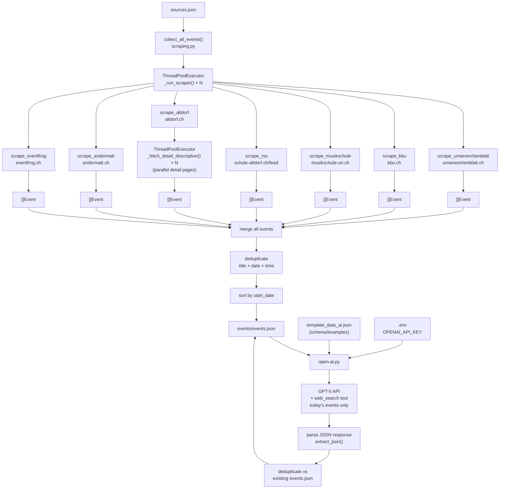

# Scraping

## Data Import


```mermaid
flowchart TD
    sources["sources.json"]
    collect["collect_all_events()\nscraping.py"]
    pool["ThreadPoolExecutor\n_run_scraper() × N"]

    sources --> collect
    collect --> pool

    pool --> s_uw["scrape_urnerwochenblatt\nurnerwochenblatt.ch"]
    pool --> s_kbu["scrape_kbu\nkbu.ch"]
    pool --> s_ms["scrape_musikschule\nmusikschule-uri.ch"]
    pool --> s_rss["scrape_rss\nschule-altdorf.ch/feed"]
    pool --> s_alt["scrape_altdorf\naltdorf.ch"]
    pool --> s_and["scrape_andermatt\nandermatt.ch"]
    pool --> s_ef["scrape_eventfrog\neventfrog.ch"]

    s_alt --> detail["ThreadPoolExecutor\n_fetch_detail_description() × N\n(parallel detail pages)"]
    detail --> altEvents["[]Event"]

    s_uw --> uwEvents["[]Event"]
    s_kbu --> kbuEvents["[]Event"]
    s_ms --> msEvents["[]Event"]
    s_rss --> rssEvents["[]Event"]
    s_and --> andEvents["[]Event"]
    s_ef --> efEvents["[]Event"]

    uwEvents --> merge["merge all events"]
    kbuEvents --> merge
    msEvents --> merge
    rssEvents --> merge
    altEvents --> merge
    andEvents --> merge
    efEvents --> merge

    merge --> dedup["deduplicate\ntitle + date + time"]
    dedup --> sort["sort by start_date"]
    sort --> eventsJson["events/events.json"]

    eventsJson --> openai["open-ai.py"]
    template["template_data_ai.json\n(schema/examples)"] --> openai
    env[".env\nOPENAI_API_KEY"] --> openai

    openai --> gpt["GPT-5 API\n+ web_search tool\ntoday's events only"]
    gpt --> parse["parse JSON response\nextract_json()"]
    parse --> dedup2["deduplicate vs\nexisting events.json"]
    dedup2 --> eventsJson
```


# Run the scraping script

```
Run Script: bash scraping/run.sh
```